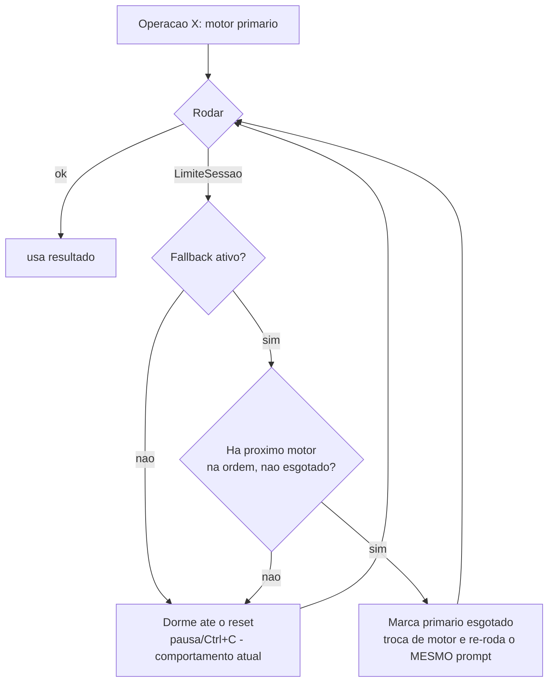

# Plano — Múltiplos Harness (Claude Code + Codex) com Seleção por Operação e Fallback

## Objetivo

Expandir o Praxis para orquestrar **mais de um harness de codificação** — hoje só o
Claude Code (`claude -p`) — de forma que:

1. **Suportar Claude Code e Codex (OpenAI)** como motores intercambiáveis.
2. **Escolher o harness por operação** (ex.: *Claude para planejar*, *Codex para
   implementar as fases* — ou qualquer outra combinação).
3. **Fallback por limite**: quando o motor principal atinge o limite de sessão/uso
   (a "franquia" de tokens), o Praxis passa automaticamente a usar o motor de
   fallback (ex.: estourou o Claude → segue no Codex) em vez de só dormir esperando
   o reset.
4. **Extensível**: a arquitetura deve aceitar novos harness no futuro (Gemini CLI,
   OpenCode, Aider…) sem reescrever o orquestrador — bastando registrar um novo motor.

### Decisão de configuração (revisada)

Toda a configuração fica **num único arquivo: `automacao/autopilot.json`**. Em vez de
criar/gerenciar múltiplos `.ini`, **consolidamos `motores.ini` e `notificacoes.ini`
dentro do `autopilot.json`**. Além disso:

- As configurações de **motor (e notificações/painel)** podem ser **alteradas pelo
  painel web**, além da edição manual do arquivo.
- **O JSON é a única fonte de verdade**: o sistema **relê o `autopilot.json` do disco
  sempre que precisa** (sem cache em memória). Qualquer alteração — pelo painel ou
  editando o arquivo — **passa a valer imediatamente**, inclusive no meio de uma rodada.

> **Motivação**: os limites de uso do Claude Code vêm sendo atingidos com frequência.
> Distribuir as operações entre dois harness (e ter fallback automático) mantém a
> orquestração andando sem intervenção manual — e um só arquivo de config, editável
> também pelo painel, simplifica a operação.

---

## Contexto e reaproveitamento

A branch `origin/novos-motores-alem-do-claude` já iniciou este trabalho e traz peças
boas que **serão reaproveitadas**, mas ela mudou coisas demais de uma vez e regrediu
funcionalidades importantes. Diretrizes deste plano:

**Reaproveitar da branch:**
- A **interface `Motor`** e o tipo genérico `OpcoesRun`/`ResultadoRun` (`motor.go`).
- O **motor Codex** (`codex.go`): `codex exec --json`, `schemaStrictOpenAI` (adapta o
  JSON Schema para o modo *strict* da OpenAI), estimativa de custo por tokens
  (`custoEstimado`) e sandbox (`read-only`/`workspace-write`).
- Os helpers genéricos: `abrirLog`, `promptComSchema`, `decodificarEstruturado`,
  `coAuthorTrailer`.

**NÃO regredir (a branch removeu — manter do `main`):**
- **Franquia/limite de sessão** com espera do reset e **pausa** (Enter) / Ctrl+C
  (hoje em `claude.go`). É o gancho onde o **fallback** se conecta.
- **Notificações** (`notificacoes.go`) e **auth do painel** (`auth.go`) — só que a
  *fonte de configuração* deixa de ser o `.ini` e passa a ser o `autopilot.json`.
- O **painel** com terminal/logs (`painel.go`).

**Mudar em relação à branch:**
- A branch pôs um **único** campo `motor` no `autopilot.json` (motor por projeto).
  Aqui o motor é escolhido **por operação**, com **fallback**, e a config de
  notificações/painel migra para o mesmo JSON.

---

## Configuração unificada — `automacao/autopilot.json`

O `autopilot.json` ganha três blocos novos (`motores`, `notificacoes`, `painel`) e
segue com os campos atuais. Exemplo:

```json
{
  "plano": "PLANO.md",
  "add_dirs": [],
  "max_budget_usd": 25,
  "timeout_min": 120,
  "max_correcoes": 2,
  "max_ciclos_revisao": 1,
  "versionar_automacao": true,
  "gates": [],
  "gates_extra": [],

  "motores": {
    "operacoes": {
      "planejar": "claude",
      "executar": "codex",
      "corrigir": "codex",
      "revisar":  "claude"
    },
    "modelos": {
      "claude": "opus",
      "codex":  "gpt-5-codex"
    },
    "fallback": {
      "ativo": true,
      "ordem": ["claude", "codex"]
    }
  },

  "notificacoes": {
    "canais": {
      "telegram":    { "ativo": false, "bot_token": "", "chat_id": "" },
      "discord":     { "ativo": false, "webhook_url": "" },
      "slack":       { "ativo": false, "webhook_url": "" },
      "google_chat": { "ativo": false, "webhook_url": "" },
      "webhook":     { "ativo": false, "url": "", "template": "" }
    },
    "eventos": {
      "inicializacao_concluida": true,
      "planejamento_iniciado":   false,
      "fase_iniciada":           false,
      "gates_falharam":          false,
      "correcao_iniciada":       false,
      "revisor_reprovou":        false,
      "troca_de_harness":        true,
      "franquia_esgotada":       true,
      "fase_concluida":          true,
      "marco_concluido":         true,
      "rodada_concluida":        true,
      "rodada_parou":            true,
      "pausa":                   false,
      "erro_interno":            true
    }
  },

  "painel": {
    "auth_ativo": false,
    "credencial_base64": "",
    "bind": ""
  }
}
```

**Semântica dos motores:**
- `motores.operacoes`: mapeia cada etapa do pipeline (`planejar`, `executar`,
  `corrigir`, `revisar`) para um motor. Chave ausente/valor vazio ⇒ motor padrão
  (`claude`). A etapa de *atualização do plano* (guarda do plano) usa o mesmo motor
  de `executar`.
- `motores.modelos`: modelo default de cada motor (usado quando a fase não sobrescreve
  via a coluna `modelo` do `fases.csv`).
- `motores.fallback.ativo`: liga/desliga o fallback automático. Desligado ⇒
  comportamento atual (dorme e espera o reset da franquia, com pausa/Ctrl+C).
- `motores.fallback.ordem`: cadeia global de motores. Ao bater o limite, o orquestrador
  escolhe o **próximo motor da ordem que ainda não esgotou nesta rodada**. Se não
  houver, cai no comportamento de esperar o reset.

**Semântica das notificações:**
- `notificacoes.canais`: os destinos (Telegram/Discord/Slack/Google Chat/webhook
  genérico) com seus segredos e `ativo`. Migração direta do antigo `notificacoes.ini`.
- `notificacoes.eventos`: liga/desliga **cada tipo de evento** individualmente (ver o
  catálogo abaixo). Um aviso só é enviado se **algum canal estiver ativo** *e* o
  **evento estiver ligado**. Evento ausente no JSON assume o default do catálogo.

**Migração e compatibilidade:**
- Se o `autopilot.json` **não tiver** o bloco `motores`, ele é preenchido com os
  padrões (tudo `claude`, fallback off) e **regravado** ⇒ comportamento idêntico ao
  atual até o usuário editar.
- Na primeira carga, se existir um `notificacoes.ini` legado, seus valores são
  **importados** para `autopilot.json.notificacoes`/`painel` (uma vez) e o `.ini`
  pode ser removido/renomeado para `.bak`. Sem `.ini`, apenas os defaults.
- Os campos legados `modelo`/`motor` no topo do JSON, se presentes, são respeitados
  como *default* quando `motores.modelos`/`operacoes` não definirem.

### Segurança: segredos no JSON

O `autopilot.json` passa a conter **segredos** (tokens de webhook, credencial do
painel). Por isso:
- O `autopilot.json` deixa de ser versionado: entra no `.gitignore` (como o
  `notificacoes.ini` já era). O versionamento do progresso (`versionar_automacao`)
  continua valendo **para o `fases.csv`** — o commit de bookkeeping por fase segue
  existindo, sem incluir o JSON com segredos.
- Um `autopilot.exemplo.json` (sem segredos) pode ser versionado como referência.
- Este é o principal risco de OWASP aqui (segredos em VCS); a mitigação acima é
  obrigatória e será coberta por uma fase própria.

---

## Fonte de verdade: sem cache

Princípio: **nunca guardar a config em memória entre operações**. Sempre reler o
`autopilot.json` do disco no ponto de uso.

- Já existe precedente: `pipelineFase` **relê a config antes de cada rodada de gates**
  (para pegar ajustes do corretor) e o painel **relê a cada requisição HTTP**.
  Estendemos esse padrão a **motores/fallback/notificações**.
- No `pipelineFase`, imediatamente **antes de cada run** (executor/corretor/revisor/
  guarda do plano), relemos o `autopilot.json` e resolvemos o motor + modelo daquela
  operação. Assim, editar o motor pelo painel (ou à mão) no meio de uma fase já vale
  no próximo passo.
- O `Notificador` e a `Auth` do painel passam a ler do `autopilot.json` **no momento
  do uso** (não são capturados uma vez no início) — inclusive os toggles de eventos, para
  que ligar/desligar um evento pelo painel valha no próximo aviso.

---

## Eventos notificáveis

Todos os pontos relevantes do pipeline passam a poder disparar um aviso por webhook.
Hoje só existem 3 avisos (rodada terminou/parou, franquia esgotada, marco concluído);
o plano generaliza para um **catálogo de eventos**, cada um com um toggle em
`notificacoes.eventos`. **Por padrão, apenas os mais importantes ficam ligados** (para
não inundar os canais); os demais o usuário liga pelo painel quando quiser.

| Evento | Chave | Padrão | Quando dispara |
|---|---|---|---|
| Inicialização concluída | `inicializacao_concluida` | **ligado** | `inicializar` terminou de quebrar o plano em fases |
| Planejamento iniciado | `planejamento_iniciado` | desligado | `inicializar` começou a analisar o plano |
| Fase iniciada | `fase_iniciada` | desligado | uma fase entrou em execução |
| Gates falharam | `gates_falharam` | desligado | um gate ficou vermelho |
| Correção iniciada | `correcao_iniciada` | desligado | o corretor foi acionado (gate/revisor) |
| Revisor reprovou | `revisor_reprovou` | desligado | o revisor emitiu veredito REPROVADO |
| Troca de harness | `troca_de_harness` | **ligado** | o fallback trocou de motor por limite |
| Franquia esgotada | `franquia_esgotada` | **ligado** | limite de sessão atingido (espera do reset) |
| Fase concluída | `fase_concluida` | **ligado** | qualquer fase concluiu com sucesso |
| Marco concluído | `marco_concluido` | **ligado** | fase com `notificar=sim` concluiu (panorama) |
| Rodada concluída | `rodada_concluida` | **ligado** | a fila foi processada até o fim |
| Rodada parou | `rodada_parou` | **ligado** | a rodada parou por falha/bloqueio |
| Pausa | `pausa` | desligado | pausa manual (Enter/Ctrl+C) |
| Erro interno | `erro_interno` | **ligado** | panic capturado na rodada |

Implementação: uma única função `notificarEvento(chave, titulo, corpo)` consulta a
config **relida do disco** e só envia se o canal e o evento estiverem ativos. Cada
ponto de notificação (existentes + novos) passa a chamá-la com sua chave. O envio
continua *best-effort* (falha nunca derruba a rodada).

## Painel: edição da configuração

O painel (`painel.go`) ganha, além das telas de leitura atuais, uma seção para
**ver e editar a configuração de motores E de notificações**, gravando direto no
`autopilot.json`.

- **Endpoints novos (protegidos pela Basic Auth existente):**
  - `GET /api/config` — devolve os blocos editáveis (`motores`, `notificacoes`
    incluindo os toggles de `eventos`) lidos do disco. **Nunca** retorna segredos em
    claro (tokens/credencial ficam mascarados; só se envia se alterados).
  - `POST /api/config` — valida e grava as alterações no `autopilot.json`
    (escrita atômica: grava em arquivo temporário e `rename`). Um segredo mascarado
    recebido de volta sem alteração **preserva** o valor atual (não sobrescreve com a
    máscara).
- **Validação** no servidor: nomes de motor conferidos contra o registro; `ordem` de
  fallback só com motores conhecidos; operações só entre as chaves válidas; chaves de
  evento só entre as do catálogo.
- **UI**: um formulário simples com duas seções:
  - *Motores*: selects por operação (`planejar`/`executar`/`corrigir`/`revisar`),
    toggle + ordem do fallback, modelo por motor.
  - *Notificações*: ativar/configurar cada canal (com segredos mascarados) e uma lista
    de **checkboxes por evento** (o catálogo acima) para ligar/desligar cada aviso.
  Ao salvar, faz `POST` e recarrega o estado.
- Como a config é sempre relida do disco, a alteração **passa a valer na próxima
  operação** sem reiniciar nada.
- **Segurança**: escrita exige a mesma Basic Auth do painel; se o painel estiver sem
  auth, a edição fica **desabilitada** por padrão (evita exposição na rede local).

---

## Arquitetura

### Interface de motor (extensível)

```go
// motor.go
type OpcoesRun struct {
    Raiz, Prompt, Modelo string
    AddDirs              []string
    BudgetUSD            float64
    TimeoutMin           int
    Schema               string           // saída estruturada desejada (JSON Schema)
    SomenteLeitura       bool             // revisor: não edita nem comita
    ProibirCommit        bool             // executor/corretor: commit é do orquestrador
    RotuloLog            string
    Ctx                  context.Context  // cancelamento (Ctrl+C)
    PausaCh              <-chan struct{}   // pausa manual durante a espera do reset
    OnEspera             func(detalhe string)
}

type ResultadoRun struct {
    IsError       bool
    Subtipo       string
    Resultado     string
    Estruturado   json.RawMessage
    CustoUSD      float64
    NumTurns      int
    TokensIn, TokensOut int
    LogPath       string
    LimiteSessao  bool   // ← preservado do main: gancho do fallback/espera
    DetalheLimite string
}

type Capacidades struct {
    SchemaNativo, BudgetNativo, CustoUSDNativo bool
}

type Motor interface {
    Nome() string
    Capacidades() Capacidades
    Rodar(op OpcoesRun) (*ResultadoRun, error)
}
```

**Diferença-chave vs. a branch**: `OpcoesRun`/`ResultadoRun` **incorporam os campos de
franquia e de cancelamento/pausa** (`Ctx`, `PausaCh`, `OnEspera`, `LimiteSessao`,
`DetalheLimite`) que existem hoje no Claude — sem isso não há como fazer fallback nem
manter a espera do reset.

### Registro de motores (para extensibilidade)

Em vez de um `switch` espalhado, um registro central. Novos harness = uma linha:

```go
var motoresRegistrados = map[string]func() Motor{
    "claude": func() Motor { return motorClaude{} },
    "codex":  func() Motor { return motorCodex{} },
    // futuro: "gemini", "opencode", "aider"...
}

func selecionarMotor(nome string) (Motor, error) { /* consulta o mapa */ }
func modeloPadrao(nome string) string            { /* "opus" p/ claude, "" p/ resto */ }
func coAuthorTrailer(nome string) string         { /* trailer de co-autoria por motor */ }
```

### Fallback (onde se conecta)

O gancho é a função que hoje trata a franquia. Fluxo por *run* de uma operação:



- Marcação de "esgotado nesta rodada" vive num pequeno estado da rodada
  (`map[string]bool` de motores esgotados), resetável quando um reset de franquia
  efetivamente ocorre.
- O fallback **re-roda o mesmo prompt** (contexto limpo — é o princípio do Praxis),
  então trocar de motor no meio é seguro: o próximo motor lê o mesmo plano/arquivos.
- Como a config é sempre relida do disco, ligar/desligar o fallback (ou mudar a
  `ordem`) pelo painel vale já na próxima decisão de fallback.
- Notificação existente (`OnEspera`) ganha uma variante: avisa "troquei do motor A
  para B por limite" quando o fallback dispara.

### Detecção de limite por motor

`LimiteSessao` passa a ser responsabilidade de cada motor:
- **claude**: mantém `limiteSessaoAtingido` atual ("session limit"/"usage limit" +
  "reset").
- **codex**: detecta as mensagens de rate/usage limit dos eventos `error`/
  `turn.failed` do `codex exec --json` (ex.: "rate limit", "usage limit", "quota",
  "429"). Sem detalhe de horário de reset, usa uma espera padrão no fallback/espera.

### Custo e budget (Codex não corta custo nativamente)

- **claude**: custo em USD nativo (`total_cost_usd`) e `--max-budget-usd`.
- **codex**: sem custo nativo → estimado por tokens (`custoEstimado`); o budget vira
  **teto soft por fase**, verificado pelo orquestrador **entre** os runs (interrompe a
  fase se `custo acumulado > MaxBudgetUSD`).

---

## Impacto por arquivo

| Arquivo | Mudança |
|---|---|
| `motor.go` (novo) | Interface `Motor`, `OpcoesRun`/`ResultadoRun` (com franquia+ctx), `Capacidades`, registro de motores, helpers (`abrirLog`, `promptComSchema`, `decodificarEstruturado`, `custoEstimado`, `coAuthorTrailer`). |
| `claude.go` | Refatorar `rodarClaude` para `motorClaude` implementando `Motor`. **Preservar** a franquia (agora emitindo `LimiteSessao` no `ResultadoRun`). |
| `codex.go` (novo) | Portar da branch: `codex exec --json`, `schemaStrictOpenAI`, sandbox, custo por tokens, **+ detecção de limite do Codex**. |
| `config.go` | Adicionar structs `Motores`/`Notificacoes`/`Painel` ao `Config`; defaults; preencher/migrar blocos ausentes e **regravar**; resolução operação→motor e motor→modelo; **helper de releitura fresca** do disco. `autopilot.json` no `.gitignore`. |
| `fallback.go` (novo) | Orquestração da execução com fallback + espera do reset (extraído/generalizado do `esperarResetFranquia` atual). Estado de "motores esgotados na rodada". |
| `executar.go` | O `rodar` do `pipelineFase` **relê a config**, resolve o motor **por operação** e executa via `fallback.go`. Budget soft; trailer de co-autoria por motor; console indica qual motor rodou cada etapa. |
| `inicializar.go` | Operação `planejar` usa o motor de `motores.operacoes.planejar` (com fallback). Garante os blocos no JSON. |
| `notificacoes.go` | `Notificador` passa a ler de `Config.Notificacoes` (relido no uso) em vez do `.ini`. Nova `notificarEvento(chave,...)` com gate por canal+evento. Importar `.ini` legado uma vez. |
| `auth.go` | Basic Auth do painel passa a ler de `Config.Painel` (relido no uso). |
| `painel.go` | Novos endpoints `GET/POST /api/config` (protegidos), UI de edição de **motores e notificações** (canais + toggles de eventos); segredos mascarados; escrita atômica. |
| `main.go` | Garantir os blocos de config no começo dos comandos. Ajustar `ajuda`. |
| `README.md` | Documentar a config unificada, exemplos de combinação, fallback e a edição pelo painel. |
| `defaults/*.md` | Prompts continuam agnósticos de motor (não citam "Claude"). Revisar textos. |
| `*_test.go` | Testes novos (abaixo); ajustar/mover os testes do `.ini`. |

**Preservar comportamento**: `gates.go`, `git.go`, `fases.go`, `status.go` seguem
intactos (a branch mexeu/removeu — aqui não).

---

## Fases (micro-fases executáveis)

Cada fase cabe numa execução de contexto limpo e termina verde nos gates
(`go build ./...`, `go vet ./...`, `go test ./...`).

- [ ] **Fase 1 — Interface de motor e registro.**
      Criar `motor.go` com `OpcoesRun`/`ResultadoRun` (incluindo `Ctx`, `PausaCh`,
      `OnEspera`, `LimiteSessao`, `DetalheLimite`), `Capacidades`, `Motor`, o registro
      `motoresRegistrados`, `selecionarMotor`, `modeloPadrao`, `coAuthorTrailer` e os
      helpers genéricos (`abrirLog`, `promptComSchema`, `decodificarEstruturado`,
      `extrairJSON`, `custoEstimado`). Mover `decodificarEstruturado`/`extrairJSON`
      de `claude.go` para cá.
      *Depende de:* —

- [ ] **Fase 2 — Motor Claude preservando a franquia.**
      Refatorar `claude.go` para `motorClaude` implementando `Motor.Rodar`, mantendo a
      lógica de limite de sessão, espera do reset, pausa (Enter) e Ctrl+C — agora
      expondo `LimiteSessao`/`DetalheLimite` no `ResultadoRun`. Ajustar `claude_test.go`.
      *Depende de:* Fase 1

- [ ] **Fase 3 — Motor Codex.**
      Criar `codex.go` (portar da branch): `codex exec --json`, `schemaStrictOpenAI`,
      sandbox `read-only`/`workspace-write`, `custoEstimado` por tokens e **detecção de
      limite do Codex** (`LimiteSessao` a partir dos eventos de erro/rate-limit).
      *Depende de:* Fase 1

- [ ] **Fase 4 — Config unificada no `autopilot.json`.**
      Em `config.go`, adicionar os blocos `motores` (operacoes/modelos/fallback),
      `notificacoes` e `painel` ao `Config`, com defaults; preencher/migrar blocos
      ausentes e **regravar**; helpers de resolução (operação→motor, motor→modelo) e um
      **helper de releitura fresca** (`carregarConfig` sem cache). Validar nomes de
      motor contra o registro.
      *Depende de:* Fase 1

- [ ] **Fase 5 — Segredos fora do VCS + migração do `.ini`.**
      Colocar `autopilot.json` no `.gitignore` (mantendo o versionamento do `fases.csv`);
      gerar `autopilot.exemplo.json` sem segredos; importar um `notificacoes.ini` legado
      (se existir) para os blocos `notificacoes`/`painel` uma única vez.
      *Depende de:* Fase 4

- [ ] **Fase 6 — Notificações e Auth lendo do JSON (sem cache) + eventos.**
      `notificacoes.go`: `Notificador` lê de `Config.Notificacoes` no momento do uso.
      Introduzir `notificarEvento(chave, titulo, corpo)` que só envia se houver canal
      ativo **e** o evento estiver ligado. Cobrir **todos os eventos do catálogo**
      (existentes: rodada concluída/parou, franquia esgotada, marco; novos:
      inicialização/planejamento, fase iniciada/concluída, gates falharam, correção,
      revisor reprovou, troca de harness, pausa, erro interno), com os defaults
      (só os importantes ligados). `auth.go`: Basic Auth do painel lê de `Config.Painel`
      no momento do uso. Remover a dependência do `.ini` em runtime (mantendo só a
      importação da Fase 5). *Obs.:* a chamada de `troca_de_harness` é ligada de fato na
      Fase 7 (quando o fallback existir).
      *Depende de:* Fases 4, 5

- [ ] **Fase 7 — Fallback e espera do reset (generalizado).**
      Criar `fallback.go`: roda uma operação com um motor primário e, ao receber
      `LimiteSessao`, decide entre **trocar para o próximo motor da ordem** (se fallback
      ativo e houver motor não esgotado) ou **esperar o reset** (comportamento atual, com
      pausa/Ctrl+C). Estado de "motores esgotados na rodada". Notificação ao trocar.
      *Depende de:* Fases 2, 3, 4

- [ ] **Fase 8 — Wiring do pipeline por operação (config fresca).**
      Em `executar.go`, o `rodar` do `pipelineFase` **relê o `autopilot.json`** e resolve
      o motor da operação (`executar`/`corrigir`/`revisar`/atualização-do-plano) antes de
      cada run, executando via `fallback.go`. Budget **soft** para motores sem corte
      nativo; trailer de co-autoria por motor no commit; console indica o motor de cada
      etapa.
      *Depende de:* Fase 7

- [ ] **Fase 9 — Wiring do `inicializar` (planejar).**
      `inicializar.go` usa o motor de `motores.operacoes.planejar` (com fallback) e
      garante os blocos no JSON. Mensagens de resumo mostram o motor usado.
      *Depende de:* Fases 7, 8

- [ ] **Fase 10 — Edição de config pelo painel (motores + notificações).**
      `painel.go`: endpoints `GET/POST /api/config` (protegidos pela Basic Auth), com
      validação server-side, escrita atômica e segredos mascarados; UI com duas seções
      — *motores* (motor por operação, fallback, modelo por motor) e *notificações*
      (canais + **checkboxes por evento**). Edição desabilitada quando o painel está sem
      auth.
      *Depende de:* Fases 4, 6

- [ ] **Fase 11 — Testes.**
      Unit: defaults/migração da config unificada; resolução operação→motor e
      motor→modelo; escolha de fallback (próximo motor não esgotado / cai na espera
      quando não há); releitura fresca refletindo mudança no disco; **gate de eventos**
      (`notificarEvento` só envia com canal+evento ativos; defaults corretos);
      `schemaStrictOpenAI`; `custoEstimado`; `coAuthorTrailer`; detecção de limite Claude
      e Codex; validação do `POST /api/config` (motores + eventos; máscara de segredo).
      Encurtar a espera nos testes como já é feito com `esperaResetFranquia`.
      *Depende de:* Fases 7, 8, 10

- [ ] **Fase 12 — Documentação.**
      Atualizar `README.md` e o texto de `ajuda` (main.go): config unificada no
      `autopilot.json`, exemplos (Claude planeja / Codex implementa; fallback), catálogo
      de eventos notificáveis e seus defaults, edição de motores/notificações pelo painel,
      requisitos (CLIs `claude` e `codex` logados), segredos fora do VCS e nota de
      extensibilidade para novos motores. Revisar os prompts em `defaults/` para
      linguagem agnóstica de motor.
      *Depende de:* Fases 8, 9, 10

---

## Riscos e decisões

- **Regressão da franquia/pausa** (o pior erro da branch): mitigado por incluir os
  campos de franquia/cancelamento já na interface (Fase 1) e refatorar o Claude
  *preservando* o comportamento (Fase 2) antes de introduzir o Codex.
- **Segredos no `autopilot.json`**: como o JSON passa a guardar tokens/credencial, ele
  sai do versionamento (`.gitignore`) e ganha um `autopilot.exemplo.json`. O
  bookkeeping por fase continua versionando só o `fases.csv`.
- **Concorrência de escrita** (painel grava enquanto a rodada relê): escrita **atômica**
  (arquivo temporário + `rename`) evita ler um JSON pela metade; a releitura fresca pega
  a versão nova ou a antiga, nunca corrompida.
- **Codex sem budget/custo nativos**: budget vira teto soft entre runs; custo é
  estimado por tokens e sinalizado como estimado no console (nunca bloqueia).
- **Schema strict da OpenAI**: `schemaStrictOpenAI` força `additionalProperties:false`
  e todos os campos em `required`; inócuo para os schemas do Praxis (veredito/init).
- **CLIs ausentes**: mensagens claras de "instale/logue `codex`/`claude`", como já é
  feito para o `claude`.
- **Extensibilidade**: novo harness = implementar `Motor` + uma linha no registro +
  (opcional) default de modelo e trailer. Nenhuma mudança no orquestrador.

---

## Critérios de aceite

1. Toda a configuração vive no `autopilot.json`; blocos ausentes são criados com
   defaults e o arquivo é regravado. Sem `motores.ini` nem `notificacoes.ini` em runtime.
2. É possível rodar o `inicializar` com Claude e as fases (`executor`) com Codex só
   editando o `autopilot.json` — ou pelo painel.
3. Alterar a config (pelo painel ou editando o arquivo) **passa a valer na próxima
   operação**, sem reiniciar (JSON como fonte de verdade, sem cache).
4. Com fallback `ativo`, ao Claude bater o limite de sessão o Praxis segue no Codex sem
   intervenção; com `ativo` falso, mantém a espera do reset (com pausa).
5. Notificações, painel, auth e a espera/pausa da franquia continuam funcionando.
6. Todos os eventos do catálogo podem notificar por webhook; por padrão só os
   importantes estão ligados, e o usuário liga/desliga cada um pelo painel.
7. Canais e toggles de eventos são editáveis pelo painel e valem na próxima notificação.
8. `autopilot.json` não é versionado; `fases.csv` continua sendo (quando ligado).
9. `go build ./...`, `go vet ./...` e `go test ./...` verdes.

---

## Registro de Andamento

<!-- Cada fase adiciona aqui: data, o que foi feito, decisões/desvios e achados úteis. -->

- _(vazio — preencher conforme as fases forem concluídas)_
